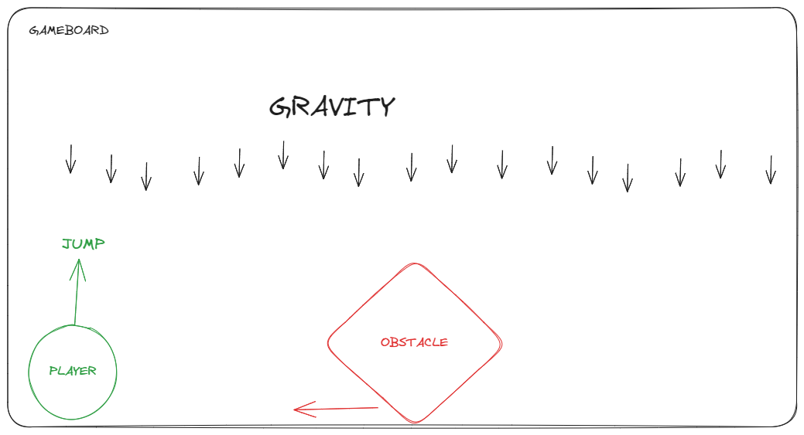

# JS-Game

## My project idea
The initial idea of my game is to do something similar to the Dinosaur T-Rex Game.
The player should be able to jump and avoid the obstacle. 
If the player and the obstacle collide the game is over.



## Backlog

If I have time I will add upgrades:

- Choose different scenarios/players
- Jump and go down
- Collect a gun to shoot enemies


## Important concepts

- How to move a div: The position os this element has to be absolute and the container should be relative

### Create a game loop

- The game loop needs to be there only if we want to make things move without the user interaction 
```
let gameLoopID;
let frameCount = 0;

function gameLoop()
{
    frameCount++;
    //we can make something happen after a few frames
    if(frameCount % 100 === 0)
        {
            addEnemy();//adds enemy to the html and also to the array of enemies.
        }
    //Update game state
    // We add here all the functions like checkForCollisions, checkIfGameIsOver
    //RenderGame;
    if(!gameOver)
    {
        gameLoopID = requesteAnimationFrame(gameLoop);
    }
}
```

If you want certain acctions to happen after a few seconds frames, it's good to add a frameCount